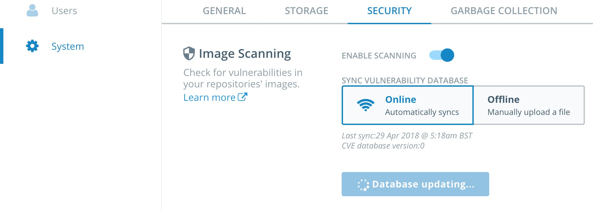
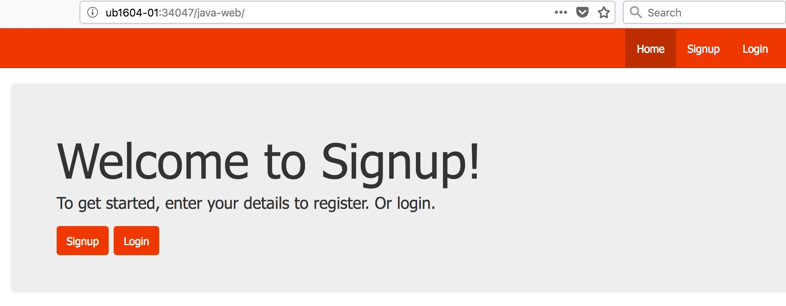
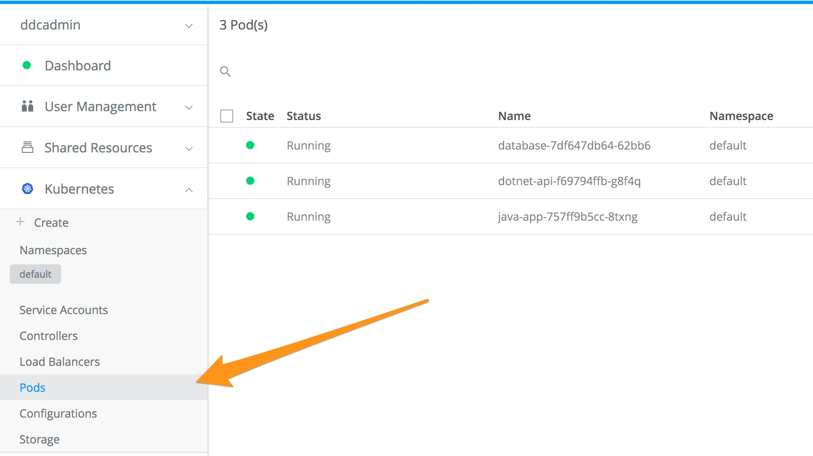
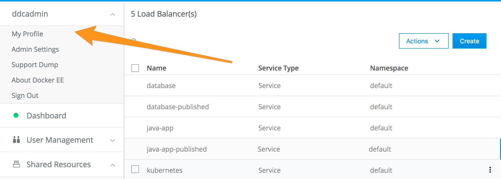

# Kubernetes in Docker Enterprise Edition

## Pre-reqs

PWD intro

Setup:

```
mkdir scm

cd scm

git clone https://github.com/dockersamples/hybrid-app.git

git clone https://github.com/sixeyed/docker-kube-workshop.git
```

## Docker Trusted Registry

enable scanning:



1.0 in UI:

-- create org


-- create first repo


-- create team CI & user


-- create team humans & user


-- get access key > env


1.1 script

```
export DTR_HOST=<your-DTR-domain>
export DTR_USERNAME=<your-DTR-admin-username>
export DTR_API_KEY=<your-api-key>
```

```
cd ~/scm/docker-kube-workshop

./part-2/dtr-01-create-repos.sh

./part-2/dtr-02-set-repo-access.sh
```

1.2 build & push

```
cd ~/scm/hybrid-app/scripts

./scripts/01-build.sh
```

Login with your human account:

```
docker login $DTR_HOST

./scripts/02-ship.sh
```

> FAIL! The human does not have permissions to push images

Now log in as Jenkins (in the real world, the CI user credentials would be secrets stored in Jenkins):

```
docker login $DTR_HOST --username jenkins

./scripts/02-ship.sh
```


## Universal Control Plane

* deploy v1 as kube stack

Inject DTR name:

```
docker-compose -f hybrid-app-v1/yml config > hybrid-app-v1-dtr.yml
```


* check app via load balancer




* configure stack, deploy v2





* check app


## Managing Kubernetes on Docker EE from Docker for Mac and Docker for Windows

* download client bundle to laptop




```
cat env.sh

cat kube.yml

eval "$(<env.sh)"
```

* kubectl get all, logs, exec

```

```
