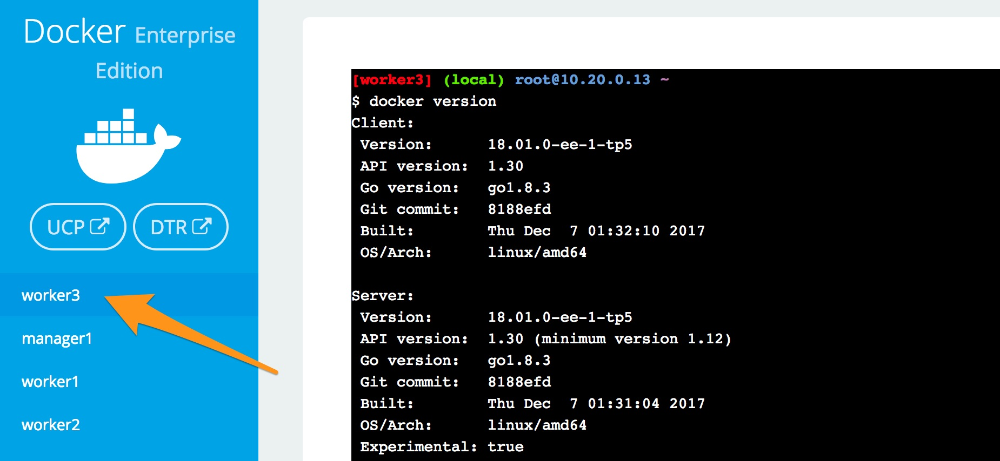
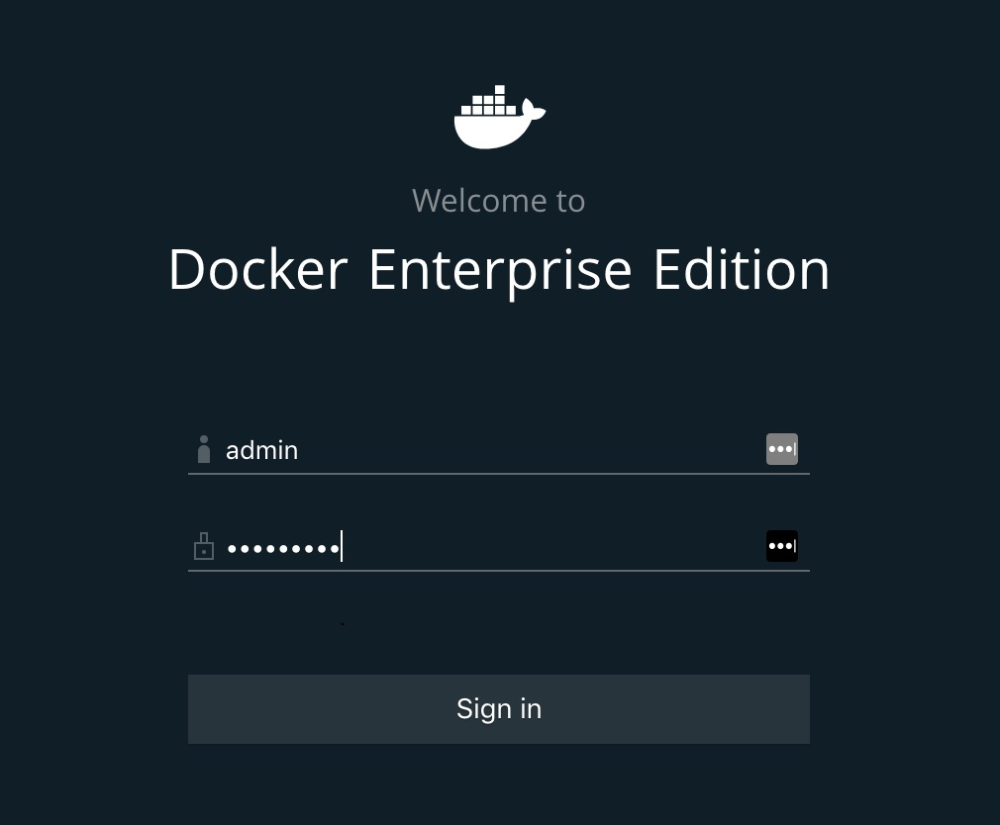
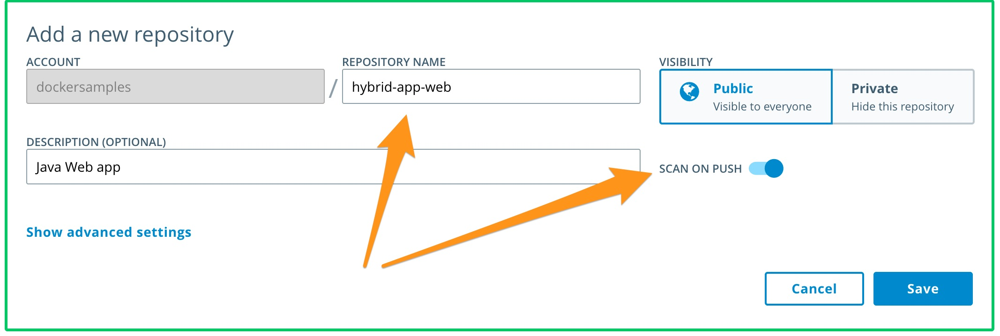
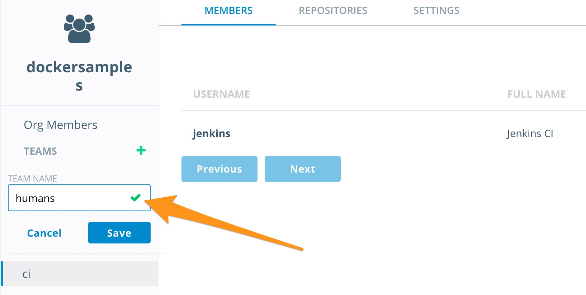
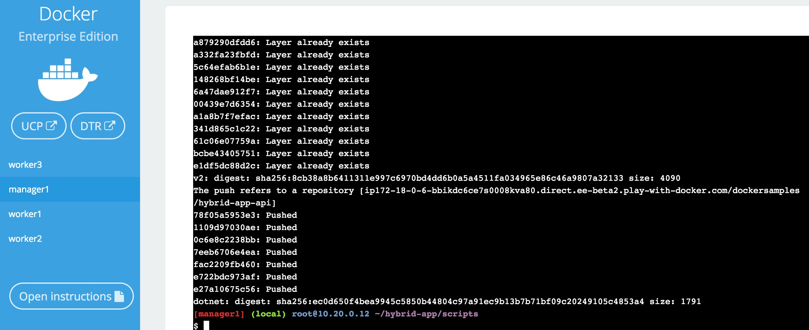
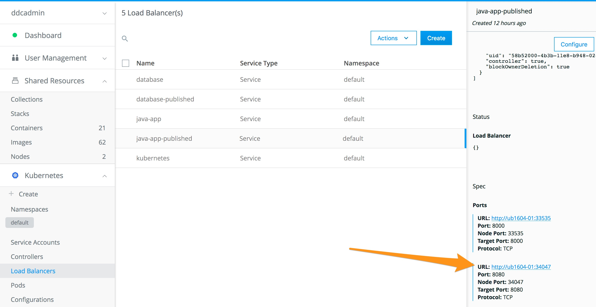
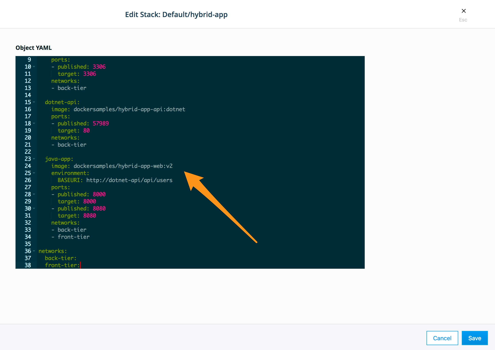

# Part 2 - Kubernetes in Docker Enterprise Edition

Docker Enterprise Edition (EE) is a container platform which provides:

* production support for containers across multiple operating systems (Windows and the top Linux distros)
* a secure image registry with image scanning, signing and promotion policies
* a multi-orchectrator management plane, supporting Kubernetes and Docker swarm

In this part of the workshop you'll start using Docker Trusted Registry (DTR) and Universal Control Plane (UCP) to build and deploy a distributed application on Kubernetes. You'll use a hosted lab environment called [Play with Docker (PWD)](https://labs.play-with-docker.com/).

> The hosted Docker EE environment is available if you're at a Docker-sponsored workshop, where you'll be given the URL for the labs. If you're not at a workshop you can sign up for a [Docker EE trial](https://trial.docker.com).

## Goals

* Understand how Kubernetes works on Docker EE with Universal Control Plane (UCP)
* Configure repositories and store images in Docker Trusted Registry (DTR)
* Deploy Docker stacks to Kubernetes using UCP with images in DTR
* Manage remote Kubernetes deployments on Docker EE from your laptop

## Steps

* [1. Set up your PWD environment](#1)
* [2. Store images using Docker Trusted Registry](#2)
* [3. Deploy and upgrade application using Universal Control Plane](#3)
* [4. Manage Kubernetes on Docker EE from Docker for Mac and Docker for Windows](#4)

## <a name="1"></a> 1 - Set up your PWD environment

You'll have your own lab environment at a pre-arranged workshop. That may happen through a [Docker Meetup](https://events.docker.com/chapters/), a conference workshop, or an arrangements between Docker and your company. The workshop leader will provide you with the URL to a workshop environment that includes [Docker EE](https://www.docker.com/enterprise-edition):


There are three main components to the Play with Docker (PWD) interface.

### 1.1 - Clone the lab repo on a worker node

Play with Docker provides access to a multi-node Docker EE cluster:

* A Linux-based Docker EE 18.01 manager node
* Three Linux-based Docker EE 18.01 worker nodes

By clicking a node name on the left, the console window will be connected to that node:



Start by connecting to `worker3` and cloning the source for this workshop and for the application you'll be building:

```
mkdir scm && cd scm

git clone https://github.com/dockersamples/hybrid-app.git

git clone https://github.com/sixeyed/docker-kube-workshop.git
```

### 2.2 - Set up your session

Throughout the lab you will be asked to provide either hostnames or login credentials that are unique to your environment. These are displayed at the bottom of the screen in the _Session Information_:


The dynamic URLs are very long, so store the _DTR hostname_ field in an environment variable to simplify later commands:

```
export DTR_HOST=<your-DTR-hostname>
```

> Make sure you use **your** DTR hostname from the PWD session panel.

### 3.3 - Access to Universal Control Plane (UCP) and Docker Trusted Registry (DTR)

PWD also has links to the Universal Control Plane (UCP) management UI as well as the Docker Trusted Registry (DTR) UI. Clicking on either the `UCP` or `DTR` button will bring up the respective server web interface in a new tab.

Click on the UCP link to open Universal Control Plane. The lab uses self-signed HTTPS certificates, so you'll see a connection warning which you can ignore (add an exception to the site in your browser).

Log in to UCP using the username and password from your PWD session information:



You'll see the UCP homepage where you can navigate around the cluster. Now switch back to the PWD session and click the link to open DTR. DTR shares authentication with UCP, so you are already logged into DTR with the same user credentials.

## <a name="2"></a> 2 - Using Docker Trusted Registry

Security scanning is an optional feature in DTR. We'll enable it now so we can scan images that we push, to find any security issues in the image binaries.

Click on _System_ in the left-hand nav, and then _Security_ from the top nav. Click _Enable scanning_ and select the online sync option:


DTR downloads a database of known vulnerabilities, which it will use to scan images. DTR will sync its vulnerability database with a live database maintained by Docker, Inc.

### 2.1 - Create organization, repository, teams and users

DTR provides fine-grained access control over who can see repositories, and push and pull images. In this step you'll set up a repo using the web UI, and create some teams and users.

Click the _Organizations_ link in the left nav, and click _New organization_:


Call the organization `dockersamples` and click _Save_:


The organization is a way to group multiple repositories. You'll use this organization for several repos in the demo application project.

Browse to the `dockersamples` organization and select _Repositories_ in the top nav. Click _New repository_:


Name the repository `hybrid-app-web` and select the _Scan on push_ option:



In a production environment you would link UCP to your existing enterprise credential store - using LDAP or Active Directory. UCP can also manage its own users, and in DTR you can create users and teams which are then available in UCP.

Click on the plus sign in the _Teams_ list and add a new team called `ci`:


Select the `ci` team, click _Add user_ and add a new user called `jenkins` (use a password you can remember for later in the lab):


The `ci` team represents service accounts which will have permission to push images as part of a CI pipeline. There will also be humans working on the project who will only have pull access.

Add a new team called `humans`:



And a new user in the `humans` team (use a username and password you can remember later):


Now you have an organization and repository, and authentication configured for some users. You can configure access rules in the DTR UI, but DTR also has an API. You'll use that next so you see how to script project access, which might be part of a project on-boarding process.

### 2.2 - Script repository access using the DTR API

You're still logged into DTR as the admin user, so your account has rights over all organizations and repositories. To work with the DTR API you need to generate an API key for your account.

Click the username dropdown in the top right of the screen and select _Profile_:


Now select _Access Tokens_ in the top nav and click _New access token_:


Use the description `API` and click _Create_:


You'll see a generated access token - this is your only chance to see this key - copy it to the clipboard:


Now switch back to your PWD session and the console for `worker3`. Add your DTR credentials - the `admin` username from session information, and your new API key - as environment variables:

```
export DTR_USERNAME=<your-DTR-admin-username>
export DTR_API_KEY=<your-api-key>
```

You should now have three DTR environment variables in your session, which you can check with `printenv | grep DTR`:


Now switch to the workshop source code and run two scripts which use the DTR API. The first creates more image repositories, and the second grants repository access to the teams:

```
cd ~/scm/docker-kube-workshop

./part-2/dtr-01-create-repos.sh

./part-2/dtr-02-set-repo-access.sh
```

Browse back to DTR, open the `dockersamples` organization and check the repository access for the `ci` team - you'll see the team has read-write access to all three repositories, which means CI users can push and pull images:


And the `humans` team has read-only access, which means members of the team can pull images but can't push them:


### 2.3 - Build and push images to DTR

You'll verify the repository access is correct by building images on a wokrer node and pushing to DTR.

Start by connecting to your `worker3` node on PWD and running a script which builds three images for the app - a database using MySQL, a web app using Java, and a REST API using .NET Core:

```
cd ~/scm/hybrid-app/scripts

./01-build.sh
```

It will take a few minutes to pull all the base images and build the apps. You can check out the Dockerfiles here - note that Java and .NET Core are using multi-stage builds to compile the apps from source and package them into Docker images:

* [Dockerfile for the MySQL database](https://github.com/dockersamples/hybrid-app/blob/master/database/Dockerfile)
* [Dockerfile for the Java web app](https://github.com/dockersamples/hybrid-app/blob/master/java-app-v2/Dockerfile)
* [Dockerfile for the .NET Core REST API](https://github.com/dockersamples/hybrid-app/blob/master/dotnet-api/Dockerfile)

When the image have built on your worker node, login to DTR **with your human account** and try to push the images:

```
docker login $DTR_HOST

./scripts/02-ship.sh
```

> FAIL! The human does not have permissions to push images, so DTR responds with an error: `denied: requested access to the resource is denied`.

In production you'd have a CI server running the build and push scripts, and the service account credentials for DTR would be securely stored in the CI server.

In this lab you'll just login to DTR as the CI user directly, and then you have access to push images:

```
docker login $DTR_HOST --username jenkins

./scripts/02-ship.sh
```

Now the images are successfully pushed to DTR:



Switch back to the DTR UI, open one of the repositories and click _Images_ in the top nav, and you'll see that an image has just been push by the `jenkins` user:


## <a name="3"></a> 3 - Deploy and upgrade an application using Universal Control Plane

In [Part 1](part-1.md) you deployed applications as Docker stakcs running on Kubernetes in your local Docker desktop environment. Docker EE supports the same functionality using Universal Control Plane. In this section you'll deploy the hybrid app to Kubernetes on UCP, using a Docker Compose file.

### 3.1 - Deploy V1 of the app to Kubernetes

There's a [compose file for V1 of the app](part-2/hybrid-app-v1.yml), where the Java web app connects directly to the MySQL database. The compose file uses an environment variable for the DTR host, so first you need to use `docker-compose config` to interpolate the variable.

On your `worker3` node run:

```
cd ~/scm/docker-kube-workshop/part-2

docker-compose -f hybrid-app-v1.yml config > hybrid-app-v1-stack.yml
```

Check out the new stack file and you'll see the image names have been expanded with your DTR host:

```
cat hybrid-app-v1-stack.yml
```

Select the whole of the stack file and copy it to the clipboard.

Now switch to your UCP tab and and select _Shares Resources...Stacks_ form the left nav. Click on _Create stack_:


Now deploy the V1 stack file as a stack on Kubernetes, using the following configuration:

* _Name_: `hybrid-app`
* _Mode_: `Kubernetes Workloads`
* _Namespace_: `default`

Then paste the V1 stack file contents into the compose pane and click _Create_:


The app deploys to Kubernetes, creating services and pods for the database and the web app.

### 3.2 - Check V1 of the app

You can see the application containers in the _Shared Resources_ section of UCP, and the deployed resources from the _Kubernetes_ section in the left nav of UCP.

Open _Kubernetes...Load Balancers_ in the left nav and you'll see the public port where the app is accessible, under the `java-app-published` service:



Click the link where the target port is `8080`, and then browse to `/java-web/` on that URL. You'll see the homepage for the app:


Next you'll upgrade the app to version 2, adding a REST API which the web app uses to access the database.

### 3.2 - Deploy V2 of the app by upgrading the stack

You'll need to use Docker Compose again to expand the DTR hostname in the compose file for V2 of the app.

On your `worker3` node run:

```
cd ~/scm/docker-kube-workshop/part-2

docker-compose -f hybrid-app-v2.yml config > hybrid-app-v2-stack.yml

cat hybrid-app-v2-stack.yml
```

Copy the whole of the V2 stack file to the clipboard, then switch back to UCP.

Open _Stacks_ from the _Shared Resources_ panel in the left nav, select the `default/hybrid-app` stack and click _Configure_:


You upgrade the application by applying a new stack defintion, so paste the V2 stack into the compose pane and click _Save_:



Switch to the _Kubernetes...Pods_ list in the left nav and you'll see you now have a .NET API pod along with the MySQL database and Java web pods:


Back in the _Kubernetes...Load Balancers_ list you can navigate to the Java web app service (the .NET API service is also publicly available):


The .NET API writes some basic log entries when it starts. You manage containers in UCP in the same way, whether they're in Kubernetes pods on Linux nodes, or swarm services on Windows nodes.

From _Shared Resources...Containers_ you see the list of all running containers, acrodd all the orchestrators. You can select the .NET API and click _View Logs_:


The app logs are shown here, and from the container list you can also connect to the container to enter a shell session:


## <a name="3"></a> 4 - Manage Kubernetes on Docker EE from Docker for Mac and Docker for Windows

You can remotely manage your Docker EE cluster by downloading a client bundle from UCP. Communication between your client and UCP is secured with mutual TLS, and the client bundle contains certificates and setup scripts. Your client certificate identifies your account and enforces access control with the same permissions as in the UI.

In UCP click your username in the left nav and select _My Profile_:


Click _New Client Bundle_ and then _Generate Bundle_ to create a client bundle which gets downloaded to your machine:


On your laptop, expand the ZIP file, open a terminal window and browse to the client bundle folder. You'll see a set of certificate and script files:

```
$ pwd
/Users/elton/Downloads/ucp-bundle-admin
$ tree
.
├── ca.pem
├── cert.pem
├── cert.pub
├── env.cmd
├── env.ps1
├── env.sh
├── key.pem
└── kube.yml

0 directories, 8 files
```

Check the contents of the `env.sh` and `kube.yml` files and you'll see that they set the configuration for the Docker CLI and `kubectl` to securely connect to your UCP instance:

```
cat env.sh

cat kube.yml
```

Run the environment script, and your local CLI is now connected to the remote UCP instance - for both `docker` and `kubectl` commands:

```
eval "$(<env.sh)"
```

You can run all the usual Kubernetes commands to work with resources in UCP:

```
$ kubectl get deployment
NAME         DESIRED   CURRENT   UP-TO-DATE   AVAILABLE   AGE
database     1         1         1            1           26m
dotnet-api   1         1         1            1           15m
java-app     1         1         1            1           26m
```

And you can use `docker stack deploy` to deploy and upgrade applications on the Docker EE cluster.

## Up Next

On to [Part 3](./part-3.md) where you'll learn how to secure deployments with Docker EE, including image management with DTR and role-based access control in UCP.
