# Part 3 - The Secure Software Supply Chain with Kubernetes and Docker EE

Docker EE is a production-grade container platform which supports a secure software supply chain.

Containerized apps offer new security models which work together to give you secure end-to-end deployment and management of your apps.

In this part of the workshop you'll learn how the secure supply chain works in Docker EE.

## Goals

* Understand how DTR features let you sceure your application images
* Use role-based access control in UCP to secure access to your cluster
* Learn how Docker content trust and image signing enforce audit policies

## Steps

* [1. Using scanning and promotion policies in DTR](#1)
* [2. Managing user security with RBAC in UCP](#2)
* [3. Exploring image signing and content trust](#3)

## <a name="1"></a> 1 - Using scanning and promotion policies in DTR

DTR provides security scanning for images, which is the first part of securing your supply chain.

Image scanning tells you if there are known vulnerabilities in your image - including the dependencies your app uses, and the components of the image OS.

### 1.1 - Examine scan results

Browse to the `dockersamples/hybrid-app-web` repository in DTR, and open the _Images_ tab:


When you created the repository you enabled security scanning, so images are scanned on every push.

You'll see both images have a lot of known security issues. Click on _View Details_ for either image and you'll see that DTR tells you exactly which layers and components have vulnerabilities, and you can navigate to the CVE database to read about the issues:

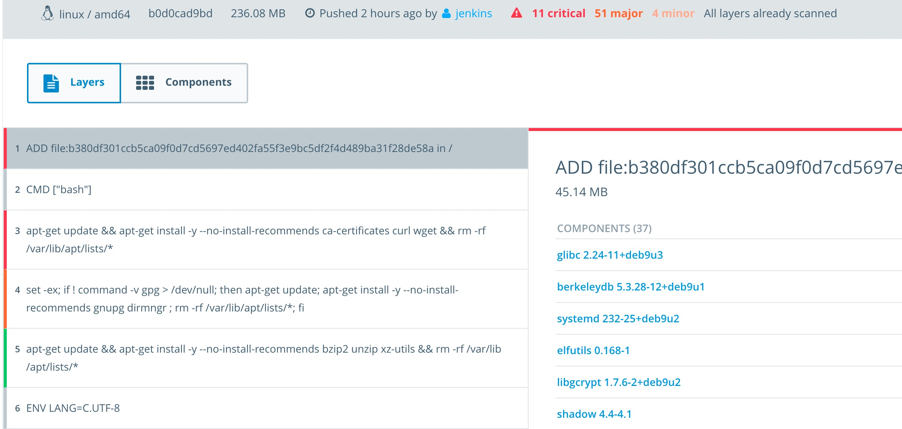

With so many vulnerabilities, you may not want this version of the app to go to production. DTR has a mechanism to enforce that with image promotion.

### 1.2 - Image promotion in DTR

Image promotion works by copying an image from one repository to another repository, if it matches rules which you specify.

You can use image promotion to copy images from the repository where your CI pushes them, to a repository which you use for production. You set up your production repositories so that users have push access, so images can only get there if they pass the promotion rules ands are promoted by DTR.

Create a new organization in DTR which will be where images for production deployment get stored:


And in that organization create a repository for the `hybrid-app-web` web front-end:

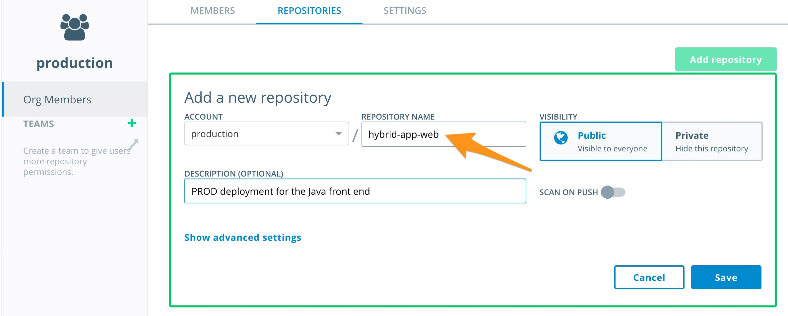

Add a new promotion policy:

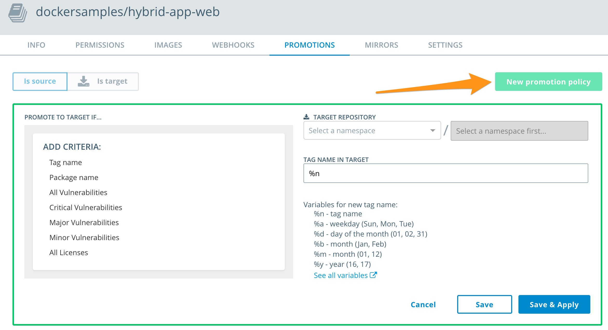

And specify two criteria:

* _Tag name_ must contain the string `v`
* _Critical vulnerabilities_ must be less than or equal to `5`

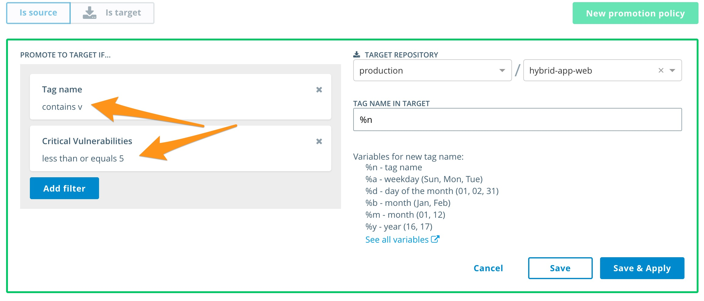

Click _Save & apply_ to enforce the promotion rules.

### 1.3 - Build and push a more secure Java image

The base image for the Java app has a lot of vulnerabilites in the OS layers. We can use a slimmer base image like Alpine to reduce the attack surface, and that will have fewer vulnerabilities.

Start by building a new version of the application image, using a Dockerfile which has the same content except for the bade Java image.

On your `worker3` terminal session:

```
cd ~/scm/hybrid-app/java-app-v2

docker image build --tag $DTR_HOST/dockersamples/hybrid-app-web:v2-alpine --file ./Dockerfile.alpine .

docker image push $DTR_HOST/dockersamples/hybrid-app-web:v2-alpine
```

You'll see the new image being pushed to DTR:


In DTR you can see that the new image is being scanned, because the repository was created with the _Scan on push_ setting enabled:


When the scan completes, the promotion rules will be evaluated.

This new version has far fewer vulnerabilities - only 4 critical :) - and it has a version number in the image tag, so it passes the promotion policies:


Open the `production/hybrid-app-web` repository and you'll see an image in there which has been promoted from the source repo:


You now have DTR configured so you can enforce security policies for your application images.

## <a name="2"></a> 2 - Managing user security with RBAC in UCP

UCP provides its own authentication store, and it can integrate with an external LDAP authentication server.

Authorization is managed with Role-Based Access Control, where access grants are made for a role to use a set of resources.

This is a powerful mechanism that lets you enforce access to your cluster along custom boundaries - you could specify that testers have read-only access to all containers, or that a project team have full access to certain nodes.

RBAC in UCP is integrated with the container runtime and the orchestrators, so you can apply rules based on swarm objects, Kubernetes resources or containers.

### 2.1 - Create a new Kubernetes namespace

Start by creating a Kubernetes namespace which you can use for the production deployment of the app, you can do this on your laptop using the UCP client bundle from part 2:

```
kubectl create namespace hybrid-app
```

Browse to UCP and open the _Kubernetes...Namespaces_ tab to verify the new namespace is there:


### 2.2 - Create a new team and user in UCP

You'll create a new team to represent testers, and give the test team a strange set of permissions - they'll be able to manage all the nodes in the cluster, but they'll only have view access to the new Kubernetes namespace.

In UCP browse to the _User Management...Organizations and Teams_ tab. You'll see the same set of organizations that you created in DTR, together with an internal `docker-datacenter` org:

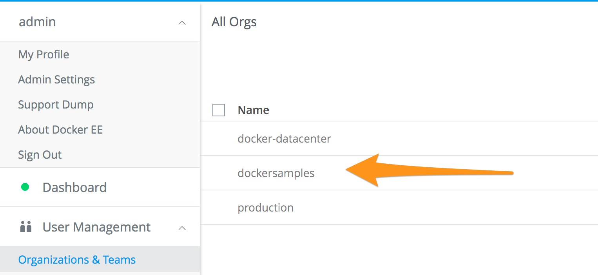

Select the `dockersamples` organization and you'll see the `ci` and `humans` teams from DTR are also there:


UCP and DTR share security principles - users and teams - so you can create them in either interface and use them in both.

Click _Create Team_ and a new team called `testers`:

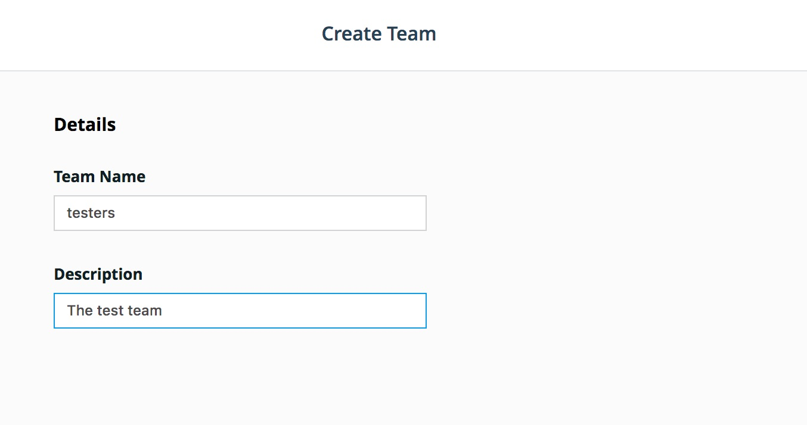

Now browse to _User Management...Users_ and click _Create User_:


And add a user called `tester`:

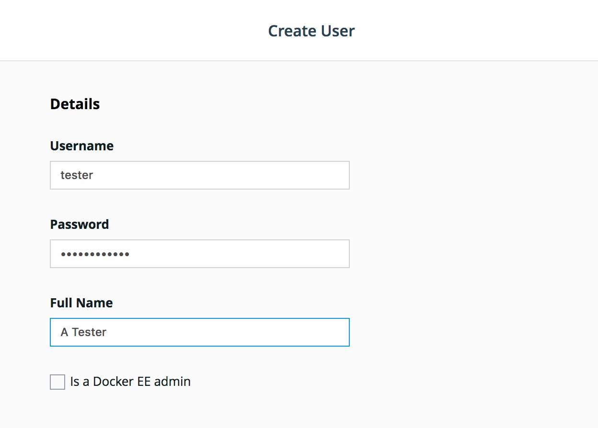

Browse back to _User Management...Organizations & Teams_, select the `dockersamples` org and the `testers` team, and click _Actions...Add Users_:


Select the new `tester` user to add them to the `testers` team:

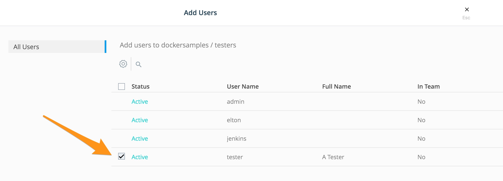

The new user is now a member of the new team in the organization. You can browse back to DTR now and you'll see the `testers` team exists in DTR, but the users don't have access to any of the `dockersamples` repositories:

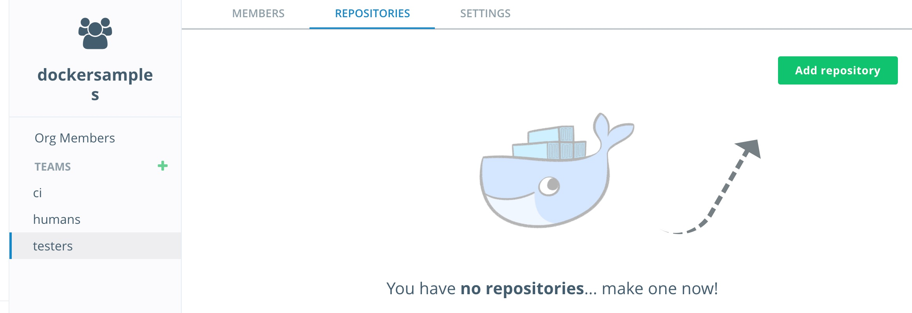

### 2.3 - Set up collections and grants in UCP

RBAC is applied in UCP by creating a **grant**, which defines how much access a subject has to a set of resources.

The subject is a user, a team or a service account. The access is defined in a **role**. The resources are defined in a **collection**.

You'll create grants and roles in UCP to give the test team the access they need. Start by navigating to _User Managment...Grants_ in UCP and click _Create Grant_:

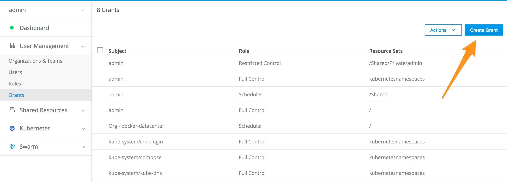

This grant will be for view-only access to the new Kubernetes namespace. Clicl _Namespaces_ and select `hybrid-app`:

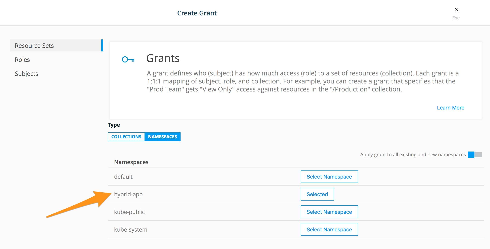

Now load the _Roles_ tab and select the built-in role `View Only`:


Finally select the _Subjects_ tab to choose who this applies to. Select _Organizations_ and the `dockersamples` organization, and then the `testers` team:


Click _Create_. Now users in the test team have acces to view any resources in the Kuberetes namespace, but they cannot edit them.

`View Only` is a built-in role in UCP, and you can also create your own custom roles for fine-grained permissions.

In the _Organizations and Teams...Roles_ tab, click _Create Role_:


Give the custom role a name of `Node Manager`:

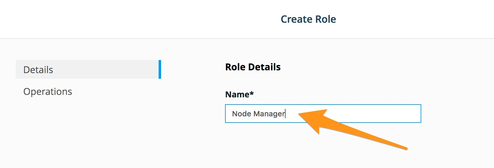

And in the _Operations_ tab scroll down through the available options and select `All Node operations`:

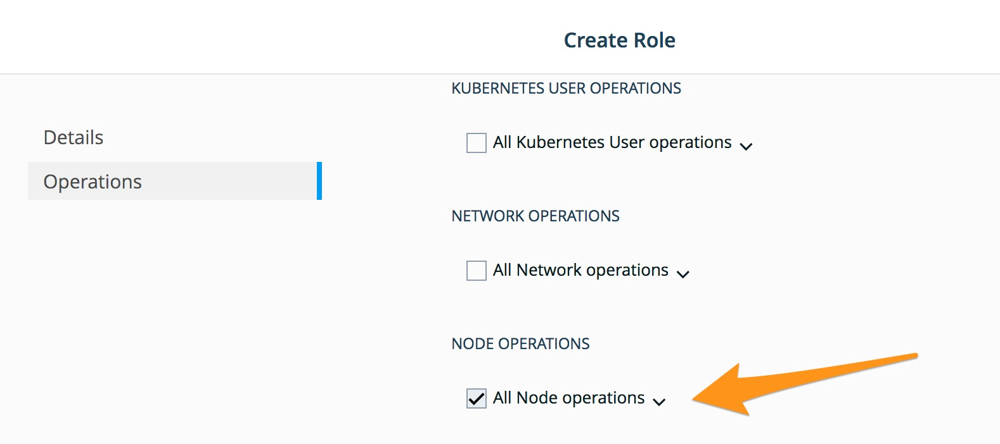

Click _Create_. This role now has access to do any read and write operations on any node.

> This is a very powerful role...

Now add a grant for the new role to the testers team. In the _Resource Sets_ tab, click _Collections_ which gives you access to all the swarm and cluster resources. Select `Swarm` and then `System`:

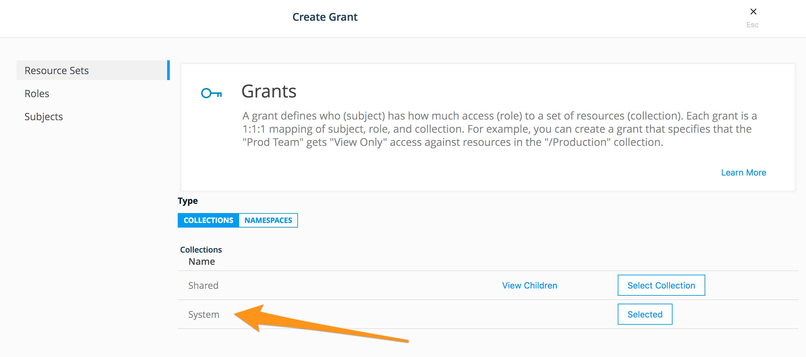

All the nodes in the cluster belong to the `System` cvollection by default. You can create custom collections and stripe your cluster in different ways if you need to.

In the _Roles_ tab, select the new `Node Manager` role:


And in the _Subjects_ tab select the `dockersamples` organization and the `testers` team:


Click _Create_ and now the test team have the permissions they need. Open _User Management...Grants_, and you'll see those grants for the `testers` team:

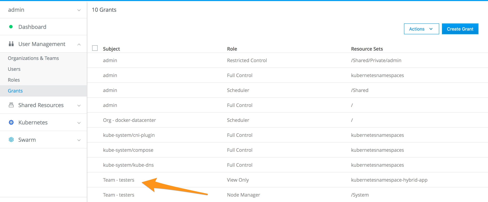

### 2.4 - Verify tester access to Docker EE

In UCP click your username in the top-left and _Sign Out_. Log in again as the `tester` user you set up:

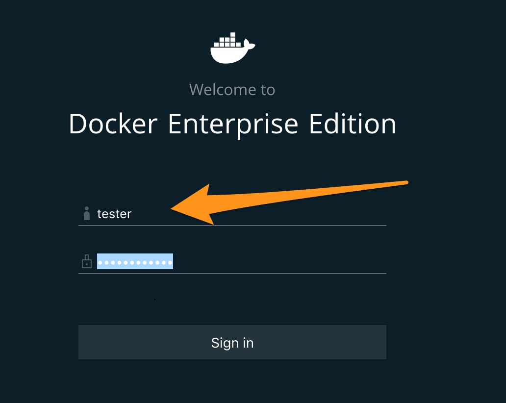

You'll see the tester has access to all the nodes (you can manage them to appy labels, drain the node and even remove them from the cluster) - but the only Kubernetes namespace which is available is `hybrid-app`:

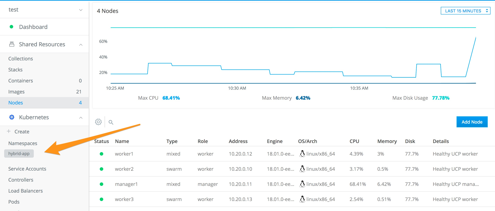

You can follow the steps from Part 2 to download a client bundle from UCP, so you can use `kubectl` on your laptop with the permissions of the test account.

When you do that, you have no access to the `default` namespace, only to the `hybrid-app` namespace:

```
$ kubectl get pods
Error from server (Forbidden): pods is forbidden: User "https://enzi.example.com#8d4e8ae8-0388-497c-9727-8e46d5d894c4" cannot list pods in the namespace "default": access denied

$ kubectl get pods -n hybrid-app
No resources found.
```

## <a name="3"></a> 3 - Exploring image signing and content trust

You've now set up Docker EE so your DTR rule enforce the security of your application images, and UCP enforces security for access to your cluster.

The final part of the secure software supply chain is signing images with a digital signature in DTR, and configuring UCP so it will only run containers from signed images.

This is called Docker Content Trust. DTR stores the signatures for images using Notary, and UCP can enforce content trust. In the Admin Settings of UCP, content trust can require images to be signed by specific teams:


The cluster physically won't run containers from images unless they've been signed by users in those teams, which acts as an enforced audit trail for software deployment.

Kubernetes doesn't have the same concept of content trust, but because the platform uses Docker EE as the engine, which is controlled by UCP, then the same policies apply.

We won't have time to demonstrate signing images in theis workshop, but [Docker Captain](https://www.docker.com/docker-captains) [Nigel Poulton](https://www.docker.com/captains/nigel-poulton) has produced a great YouTube video which covers the process: [Docker Content Trust Image Signing](https://www.youtube.com/watch?v=ZZWlo2YIfpY).

> The Docker team are actively integrating the Notary client functionality into the Docker CLI, so soon content trust will be even easier with the `docker trust sign` command.
